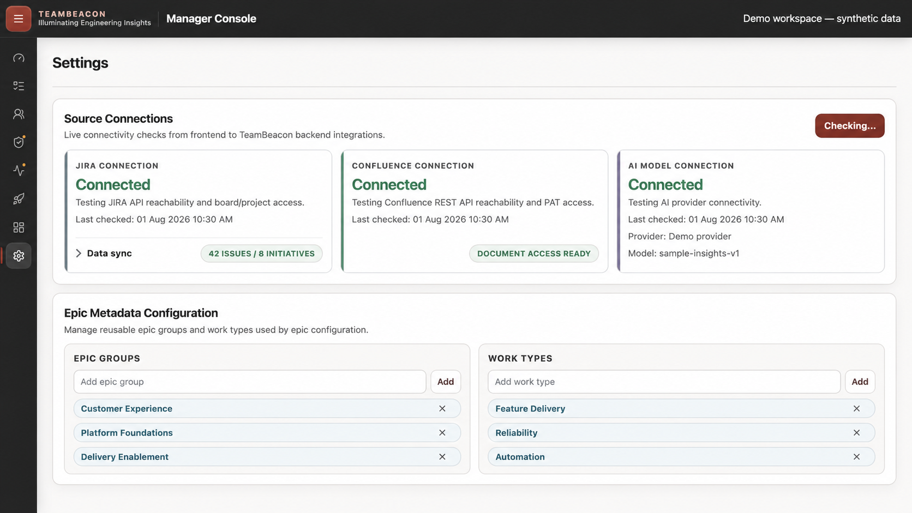
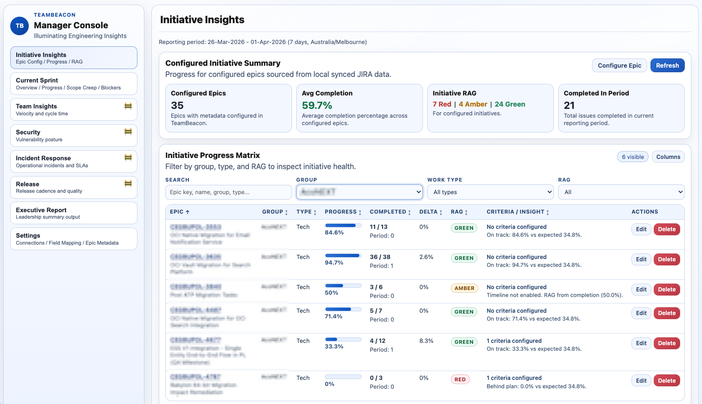
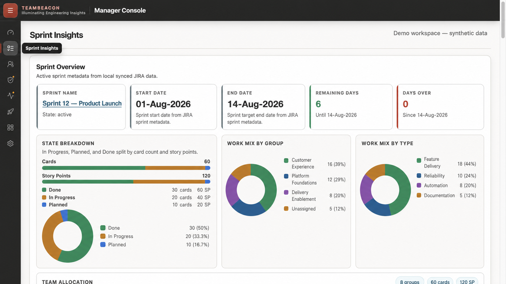
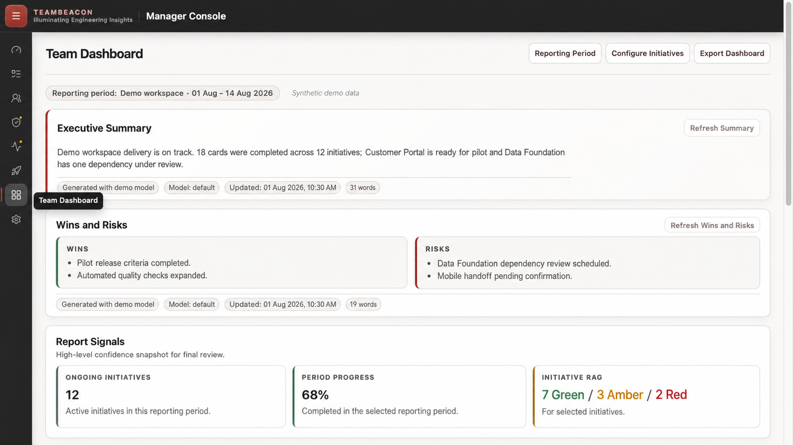

# TeamBeacon

TeamBeacon is a self-hosted engineering intelligence web app that sits on top of existing delivery data sources and helps Engineering Managers operate with clearer signals, lower cognitive load, and better delivery outcomes.

## 🎯 Overview
- Containerized workflow that can run locally on the manager's machine.
- Non-destructive integration model (does not modify upstream source data).
- Metadata-driven insight layer (Group/Type/Epic configuration).
- AI-powered insights with pluggable provider support (OCI, Ollama, OpenAI).

## ✨ Core Capabilities
- Settings: source connectivity checks, sync controls, metadata configuration, and AI Model Connection status (provider + model).
- Initiative Insights: progress matrix, filters, and RAG visibility.
- Initiative Deep Dive: group/epic-scoped weekly intake and completion flow, current WIP, and selectable work-item activity windows.
- Team Insights: sprint trend window controls (1/2/3/4/6/8/10/12), completed story points, and cycle-time trend metrics.
- Sprint Insights: state breakdown, work mix, scope-change and blocker visibility.
- Release Insights: release overview, selectable cycle-time trend, overdue readiness, and completed-release quality signals.
- Team Dashboard: AI-generated summary, wins/risks, initiative progress, and work-mix visibility for leadership updates.

## 📣 Communication One-Pager
For product messaging, capability narrative, and value framing, see:
- [TeamBeacon Communication One-Pager](docs/communication/communication_one_pager.md)

## 🖼️ Feature Preview
The following live-app captures use a synthetic demo workspace so project, sprint, and operational details remain safe to share.

<table>
  <tr>
    <td align="center">
      <br />
      <sub>Settings Overview</sub>
    </td>
    <td align="center">
      <br />
      <sub>Initiative Insights</sub>
    </td>
  </tr>
  <tr>
    <td align="center">
      <br />
      <sub>Sprint Insights</sub>
    </td>
    <td align="center">
      <br />
      <sub>Team Dashboard</sub>
    </td>
  </tr>
</table>

## 🧱 Repository Layout
```text
TeamBeacon/                  # Repository root
  app/                       # React + Vite web frontend
  services/                  # Runtime services
    api/                     # Local API endpoints and orchestration
  packages/                  # Shared Python packages
    connectors/              # Source connector configs and clients
  docs/                      # Product/architecture/design/ops/communication documentation
    communication/           # Communication one-pager and redacted screenshots
    architecture/            # Architecture reference docs
    design/                  # UI/UX mockups and design notes
    plans/                   # Delivery and implementation plans
    ops/                     # Operational runbooks
  tests/                     # Backend unit/integration test suites
```

## 🛠️ Prerequisites
- `git` for cloning and collaboration.
- `docker` for the fastest TeamBeacon setup.
- `python3` (3.11+ recommended) for API/runtime and backend tests.
- `node` and `npm` (Node 22 recommended, aligned with CI) for frontend build/test.
- `sqlite3` CLI for local DB schema setup and ad-hoc DB checks.
- OCI Python SDK (required only when `INTELLIGENCE_PROVIDER=oci`): `python3 -m pip install oci`

## 🚀 Quick Start (Docker Compose)
1. Clone and enter the repository:
```bash
git clone https://github.com/git-mhaque/TeamBeacon && cd TeamBeacon
```

2. Configure environment variables:
```bash
cp config/.env.example config/.env
```
Configuration details are documented in [config/README.md](config/README.md).

3. Start TeamBeacon:
```bash
docker compose up -d --build

# Optional non-default port:
TEAMBEACON_HOST_PORT=19000 docker compose up -d --build
```

4. Access TeamBeacon:
- `http://localhost:18000`

## 🧪 Local Development (Optional)
1. Clone and enter the repository:
```bash
git clone https://github.com/git-mhaque/TeamBeacon && cd TeamBeacon
```

2. Configure environment variables:
```bash
cp config/.env.example config/.env
```
Configuration details are documented in [config/README.md](config/README.md).

3. Apply local database schema (mandatory before first local run):
```bash
test -f data/teambeacon.db || sqlite3 data/teambeacon.db < services/api/db/migrations/0001_initial.sql
```

4. Start frontend + local API:
```bash
cd app
npm install
npm run dev
```
- Frontend: `http://localhost:5174`
- API: `http://localhost:8000`
- API Swagger UI: `http://localhost:8000/docs`
- API OpenAPI schema: `http://localhost:8000/openapi.json`

5. Run backend tests:
```bash
python3 -m unittest discover -s tests/unit -p "test_*.py" -v
python3 -m unittest discover -s tests/integration/api -p "test_*.py" -v
```

6. Run frontend checks:
```bash
cd app
npm run build
npm run lint
npm run test:coverage
```

## ✅ CI Pipeline
- GitHub Actions workflow: `.github/workflows/ci.yml`
- Checks:
  - Backend unit tests
  - Backend API integration tests
  - Frontend typecheck, React/Vite build, lint, and coverage tests
  - Docker image build on PRs; build + publish to GHCR on `main`

## 📚 Documentation
- [TeamBeacon Communication One-Pager](docs/communication/communication_one_pager.md): product narrative, value framing, and screenshots
- [AGENTS.md](AGENTS.md): contributor conventions and repository map
- [LICENSE](LICENSE): Apache License 2.0 terms for this repository
- [config/README.md](config/README.md): required and optional environment variables
- [services/api/README.md](services/api/README.md): local API endpoints and Swagger/OpenAPI docs
- [SPEC.md](SPEC.md): product requirements and scope boundaries
- [docs/architecture/ARCHITECTURE.md](docs/architecture/ARCHITECTURE.md): technical architecture baseline
- [docs/plans/PLAN.md](docs/plans/PLAN.md): phased delivery roadmap
- [docs/plans/FRONTEND_MODERNIZATION_PLAN.md](docs/plans/FRONTEND_MODERNIZATION_PLAN.md): proposed frontend design and stack migration plan
- [docs/design/README.md](docs/design/README.md): design artifact overview
- [docs/ops/OCI_GENAI_CONNECTIVITY_SMOKE_TEST.md](docs/ops/OCI_GENAI_CONNECTIVITY_SMOKE_TEST.md): OCI-specific smoke test (use when `INTELLIGENCE_PROVIDER=oci`)
